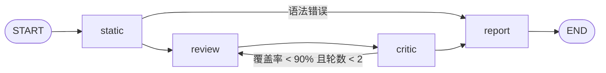

# ReviewGraph

用 LangGraph 编排的 Python 代码审查流水线，带一个能实时看到节点执行过程的网页。

粘贴代码 → 静态检查 → 模型审查 → 评审打分 → 覆盖不足则回到审查重来 → 输出报告。

## 快速开始

```bash
pip install -r requirements.txt
uvicorn app.server:app --reload
# 浏览器打开 http://127.0.0.1:8000
```

默认使用内置的离线模拟模型，不需要任何 key。要接入真实模型：

```bash
pip install langchain-openai
cp .env.example .env   # 填 OPENAI_API_KEY / OPENAI_BASE_URL / OPENAI_MODEL
export $(grep -v '^#' .env | xargs)
```

接口：`POST /api/review` 返回完整状态；`POST /api/stream` 以 SSE 逐节点推送。

## 图结构



| 文件 | 作用 |
| --- | --- |
| `app/state.py` | 图的共享状态 `ReviewState` |
| `app/analyzer.py` | 基于 `ast` 的静态规则 |
| `app/llm.py` | 离线模拟模型 / OpenAI 兼容模型适配 |
| `app/nodes.py` | 各节点与条件路由函数 |
| `app/graph.py` | 组装 `StateGraph` |
| `app/server.py` | FastAPI 接口与静态页面 |

## 测试

```bash
python -m pytest -q
```
